# 4. Концептуальная архитектура 

Концептуальная архитектура определяет фундаментальные структурные решения, домены, взаимодействия и принципы, на которых строится система. Она служит основой для логической, физической и инфраструктурной архитектуры.
Она описывает основные домены, потоки данных и границы системы без привязки к конкретным технологиям и провайдерам. Она должна быть понятна бизнесу, архитектурному комитету и командам разработки.

## 1. Применяемые архитектурные стили

### 1.1. Микросервисная архитектура 
Система строится как набор независимых доменных сервисов, каждый из которых отвечает за конкретную бизнес-функцию. 

**Причины:** 
- глобальная масштабируемость, 
- независимость команд, 
- возможность развертывания в разных облаках, 
- гибкость в выборе технологий, 
- устойчивость к отказам отдельных компонентов. *

**Характеристики:** 
- слабая связанность сервисов, 
- чёткие границы доменов, 
- контрактное взаимодействие через API и события, 
- независимые циклы релизов. 

### 1.2. Event-Driven Architecture (EDA) 
Большая часть взаимодействий между сервисами происходит через события. 
**Причины:** 
- система должна выдерживать пиковые нагрузки (соревнования, массовые тренировки), 
- асинхронность снижает задержки, 
- позволяет легко добавлять новые сервисы-подписчики,
- позволяет собирать аналитику по событиям.

### 1.3. Domain-Driven Design (DDD) 
Домены платформы выделены на основе бизнес-функций и пользовательских сценариев. 
**Причины:** 
DDD помогает: 
- избежать разрастания сервисов, 
- обеспечить чёткие границы ответственности, 
- упростить масштабирование команд.

### 1.4. Мультиоблачная архитектура 
Система разворачивается в нескольких облаках, в зависимости от задач и регионов. 
**Причины:** 
- отсутствие единого корпоративного провайдера, 
- оптимизация стоимости, 
- снижение vendor lock-in, 
- соответствие локальным законам. 

### 1.5. API-First 
Сервисы проектируются через чёткие API-контракты. 
**Преимущества:** 
- независимость клиентов, 
- возможность параллельной разработки, 
- упрощение интеграций. 

## 2. Ключевые архитектурные принципы 
### 2.1. Принцип разделения ответственности (Separation of Concerns) 
Каждый сервис отвечает только за свой домен: 
- Training Service — только тренировки, 
- Social Service — только социальные взаимодействия, 
- Inventory Service — только инвентарь. 
Это снижает сложность и повышает предсказуемость. 

### 2.2. Принцип слабой связанности 
Сервисы взаимодействуют через: - API Gateway (синхронно), - Event Bus (асинхронно). 
Это позволяет: 
- масштабировать сервисы независимо, 
- добавлять новые функции без изменения существующих. 

### 2.3. Принцип устойчивости к отказам (Resilience) 
Система должна работать даже при сбоях отдельных компонентов. 
Используются: 
- очереди и ретраи, 
- circuit breakers, 
- fallback-механизмы, 
- репликация данных. 

### 2.4. Принцип «Security by Design» 
Безопасность встроена в архитектуру с самого начала. 
Основные меры: 
- сегментация API (External / Internal / IoT), 
- региональное хранение данных, 
- шифрование в движении и покое, 
- Zero Trust между сервисами.

### 2.5. Принцип наблюдаемости (Observability) 
Каждый сервис должен быть прозрачен для мониторинга. 
Требования: 
- централизованное логирование, 
- трассировка запросов, 
- метрики по доменам, 
- алерты по SLA/SLO. 

### 2.6. Принцип «Cloud-Native» 
Система использует преимущества облаков: 
- autoscaling, -
 managed-сервисы, 
 - контейнеризация, 
 - serverless-компоненты для аналитики и уведомлений. 
 
### 2.7. Принцип «API Gateway Segmentation» 
Разделение трафика по типам клиентов: 
 - **External Gateway** — мобильные приложения, 
 - **Internal Gateway** — корпоративные системы, 
 - **IoT Gateway** — устройства и датчики. Это повышает безопасность и управляемость. 
 
### 2.8. Принцип «Data Locality» 
Данные хранятся там, где они нужны: 
 - пользовательские данные — в регионе пользователя, 
 - аналитика — в глобальном хранилище. 
Это снижает задержки и соответствует законам.

## 3. Ключевые домены

Система представляет собой глобальную спортивную социальную платформу, построенную вокруг следующих ключевых доменов:

- **User & Identity** — пользователи, профили, аутентификация, авторизация.  
- **Training & Telemetry** — тренировки, телеметрия, интеграция с устройствами.  
- **Social & Community** — группы, лента активности, взаимодействие пользователей.  
- **Gamification & Engagement** — достижения, рейтинги, челленджи.  
- **Inventory & Commerce** — инвентарь пользователя, рекомендации по экипировке, промо.  
- **Analytics & Recommendations** — аналитика, ML-модели, персональные рекомендации.  
- **Integration & Ecosystem** — интеграция с внутренними системами компании и внешними сервисами.  
- **Security & Compliance** — защита данных, соответствие законам, управление доступом.  

## 4. Основные зоны архитектуры

### 4.1. Client Zone

- **Mobile App / Web App**  
  - Личный кабинет, тренировки, социальные функции, промо, настройки.  
  - Интеграция с фитнес-функциями телефона (например, Apple Health / Google Fit).  

Роль: точка взаимодействия пользователя с платформой.

### 4.2. API & Edge Zone

- **External API Gateway**  
  - Единая точка входа для мобильных клиентов.  
  - Аутентификация, авторизация, rate limiting, маршрутизация к микросервисам.  

- **Internal API Gateway**  
  - Интеграция с e-commerce, CRM, программами лояльности, каталогами товаров.  

- **IoT Gateway**  
  - Приём данных от устройств (часы, браслеты, датчики).  
  - Поддержка нестабильных каналов, буферизация, нормализация телеметрии.  

Роль: защита периметра, унификация доступа, разделение типов клиентов.

### 4.3. Core Services Zone (микросервисы доменов)

#### User & Identity

- **User Service**  
  - Профили пользователей, настройки, предпочтения, языки, регионы.  

- **Auth Service**  
  - Интеграция с внешними провайдерами идентификации (OAuth2/OIDC).  

#### Training & Telemetry

- **Training Service**  
  - Сессии тренировок, маршруты, метрики (время, дистанция, темп).  

- **Telemetry Ingest Service**  
  - Приём и первичная обработка телеметрии от IoT Gateway и телефонов.  

#### Social & Community

- **Social Service**  
  - Лента активности, подписки, взаимодействия между пользователями.  

- **Group Service**  
  - Группы по интересам, маршрутам, регионам, событиям.  

- **Discovery Service**  
  - Поиск людей, групп, совместных тренировок (по интересам, локации, активности).  

#### Gamification & Engagement

- **Gamification Service**  
  - Достижения, уровни, бейджи, прогресс.  

- **Leaderboard Service**  
  - Рейтинги по группам, регионам, типам активности.  

- **Challenge Service**  
  - Челленджи, соревнования, массовые события.  

#### Inventory & Commerce

- **Inventory Service**  
  - Инвентарь пользователя (обувь, одежда, аксессуары), пробег, износ.  

- **Promo Service**  
  - Персональные и региональные промоакции, спортивные новости.  

- **Commerce Integration Service**  
  - Связь с e-commerce, каталогами, корзиной, заказами.  

#### Analytics & Recommendations

- **Analytics Service**  
  - Агрегация данных тренировок, поведения, вовлечённости.  

- **Recommendation Service**  
  - Персональные планы тренировок, рекомендации по инвентарю, промо.  

- **Scoring Service**  
  - Модели оценки риска перегрузки, уровня активности, сегментации пользователей.  

#### Integration & Ecosystem

- **Integration Hub**  
  - Связь с внутренними системами компании (CRM, ERP, маркетинг-платформы).  

- **3rd-Party Integration Service**  
  - Интеграция с внешними сервисами (например, соцсети для шаринга).  

### 4.4. Data & Storage Zone

- **User & Profile Store** — данные пользователей, профили, настройки (регионально сегментированы).  
- **Training & Telemetry Store** — сессии тренировок, телеметрия (time-series / cold storage).  
- **Social Graph Store** — связи между пользователями, группами, подписками.  
- **Gamification Store** — достижения, рейтинги, прогресс.  
- **Inventory & Commerce Store** — инвентарь, связи с товарами, промо.  
- **Analytics Data Lake / Warehouse** — агрегированные данные для аналитики и ML.  

Роль: хранение и доступ к данным с учётом требований по географии и безопасности.

### 4.5. Event & Messaging Zone

- **Event Bus**  
  - Публикация событий: тренировка завершена, достижение получено, челлендж обновлён, инвентарь изношен, промо доступно.  
  - Асинхронное взаимодействие между сервисами.  

- **Message Queues**  
  - Обработка телеметрии, массовых уведомлений, фоновых задач.  

Роль: масштабируемость, устойчивость к пикам нагрузки, слабая связанность сервисов.

### 4.6. Security & Compliance Zone

- **IAM / Access Control** — управление доступом сервисов и пользователей.  
- **Audit & Logging** — аудит действий, логирование для расследований и соответствия требованиям.  
- **Data Protection** — шифрование, маскирование, управление ключами.  

Роль: обеспечение безопасности, соответствие GDPR и локальным законам.

## 5. Основные потоки

### 5.1. Поток: тренировка и вовлечённость

1. Пользователь запускает тренировку в Mobile App.  
2. Данные поступают через External API Gateway / IoT Gateway → Training Service / Telemetry Ingest.  
3. Training Service сохраняет данные в Training Store и публикует событие в Event Bus.  
4. Analytics Service обрабатывает событие, обновляет агрегаты.  
5. Recommendation Service формирует новые рекомендации.  
6. Gamification Service обновляет достижения, Leaderboard Service — рейтинги.  
7. Notification Service отправляет уведомления пользователю и его друзьям.

### 5.2. Поток: социальное взаимодействие

1. Пользователь вступает в группу или создаёт её (через Mobile App → External API Gateway → Group Service).  
2. Активность пользователя (новая тренировка, достижение) публикуется в Event Bus.  
3. Social Service формирует ленту активности для друзей и участников групп.  
4. Notification Service отправляет релевантные уведомления.

### 5.3. Поток: инвентарь и промо

1. Пользователь добавляет обувь/экипировку в профиль (Mobile App → Inventory Service).  
2. Training Service обновляет пробег по инвентарю.  
3. При достижении порога износа Inventory Service публикует событие.  
4. Recommendation Service и Promo Service формируют персональные предложения.  
5. Commerce Integration Service связывает предложения с каталогом товаров.  

## 6. Адресация ключевых атрибутов качества

- **Масштабируемость**  
  - Микросервисная архитектура.  
  - Event-driven взаимодействие.  
  - Горизонтальное масштабирование сервисов и хранилищ.  

- **Надёжность**  
  - Асинхронные очереди и ретраи.  
  - Разделение критичных и некритичных путей (например, тренировка vs лента активности).  

- **Безопасность и соответствие законам**  
  - Региональное хранение пользовательских данных.  
  - Сегментация API (External / Internal / IoT).  
  - Шифрование и аудит.  

- **Наблюдаемость**  
  - Централизованное логирование и трассировка.  
  - Метрики по доменам (вовлечённость, нагрузка, ошибки).  

## 7. Границы системы и интеграции

**Внутри системы:**

- Все доменные сервисы (User, Training, Social, Gamification, Inventory, Promo, Analytics).  
- Event Bus, Data Lake, региональные хранилища.  

**Снаружи системы:**

- E-commerce, CRM, программы лояльности (через Internal API Gateway).  
- Устройства и фитнес-платформы (через IoT Gateway и интеграции с Apple Health / Google Fit).  
- Внешние новостные и спортивные источники (для контента и промо).  

---

```mermaid
flowchart TB

%% =========================
%% CLIENT ZONE
%% =========================
subgraph CLIENT[Client Zone]
    MobileApp[Mobile App]
    WebApp[Web App]
    Devices[Wearables & Sensors]
end

%% =========================
%% API & EDGE ZONE
%% =========================
subgraph APIEDGE[API & Edge Zone]
    ExternalGW[External API Gateway]
    InternalGW[Internal API Gateway]
    IoTGW[IoT Gateway]
end

%% =========================
%% CORE SERVICES ZONE
%% =========================
subgraph CORE[Core Services Zone]

    subgraph USER[User & Identity]
        UserService[User Service]
        AuthService[Auth Service]
    end

    subgraph TRAINING[Training & Telemetry]
        TrainingService[Training Service]
        TelemetryIngest[Telemetry Ingest Service]
    end

    subgraph SOCIAL[Social & Community]
        SocialService[Social Service]
        GroupService[Group Service]
        DiscoveryService[Discovery Service]
    end

    subgraph GAMIFICATION[Gamification & Engagement]
        GamificationService[Gamification Service]
        LeaderboardService[Leaderboard Service]
        ChallengeService[Challenge Service]
    end

    subgraph INVENTORY[Inventory & Commerce]
        InventoryService[Inventory Service]
        PromoService[Promo Service]
        CommerceIntegration[Commerce Integration Service]
    end

    subgraph ANALYTICS[Analytics & Recommendations]
        AnalyticsService[Analytics Service]
        RecommendationService[Recommendation Service]
        ScoringService[Scoring Service]
    end

    subgraph INTEGRATION[Integration & Ecosystem]
        IntegrationHub[Integration Hub]
        ThirdPartyIntegration[3rd‑Party Integration Service]
    end

end

%% =========================
%% EVENT & MESSAGING ZONE
%% =========================
subgraph EVENTS[Event & Messaging Zone]
    EventBus[Event Bus]
    MessageQueues[Message Queues]
end

%% =========================
%% DATA & STORAGE ZONE
%% =========================
subgraph DATA[Data & Storage Zone]
    UserStore[User & Profile Store]
    TrainingStore[Training & Telemetry Store]
    SocialGraphStore[Social Graph Store]
    GamificationStore[Gamification Store]
    InventoryStore[Inventory & Commerce Store]
    DataLake[Analytics Data Lake / Warehouse]
end

%% =========================
%% SECURITY ZONE
%% =========================
subgraph SECURITY[Security & Compliance Zone]
    IAM[IAM / Access Control]
    Audit[Audit & Logging]
    DataProtection[Data Protection & Encryption]
end

%% =========================
%% CONNECTIONS
%% =========================

%% Client → API
MobileApp --> ExternalGW
WebApp --> ExternalGW
Devices --> IoTGW

%% API → Core
ExternalGW --> UserService
ExternalGW --> TrainingService
ExternalGW --> SocialService
ExternalGW --> GamificationService
ExternalGW --> InventoryService
ExternalGW --> RecommendationService

InternalGW --> CommerceIntegration
InternalGW --> IntegrationHub

IoTGW --> TelemetryIngest

%% Core → Event Bus
TrainingService --> EventBus
TelemetryIngest --> EventBus
SocialService --> EventBus
GamificationService --> EventBus
ChallengeService --> EventBus
InventoryService --> EventBus

%% Event Bus → Core
EventBus --> AnalyticsService
EventBus --> LeaderboardService
EventBus --> RecommendationService

%% Core → Data
UserService --> UserStore
TrainingService --> TrainingStore
TelemetryIngest --> TrainingStore
SocialService --> SocialGraphStore
GamificationService --> GamificationStore
InventoryService --> InventoryStore
AnalyticsService --> DataLake

%% Security Layer
UserService --> IAM
TrainingService --> IAM
ExternalGW --> IAM
InternalGW --> IAM
IoTGW --> IAM

Audit --> UserService
Audit --> TrainingService
Audit --> ExternalGW

DataProtection --> DATA
```

