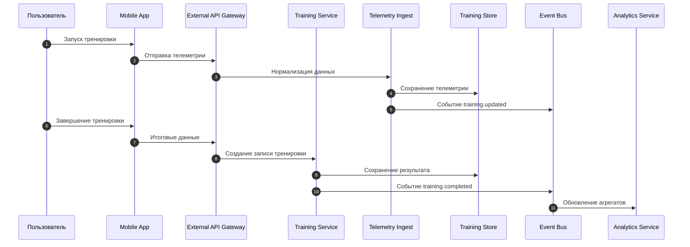
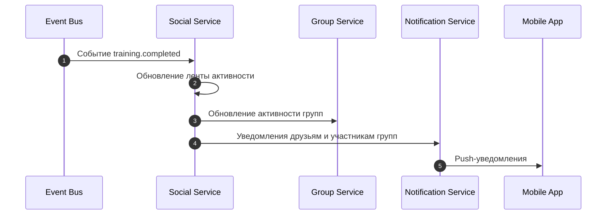
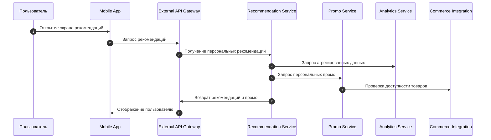
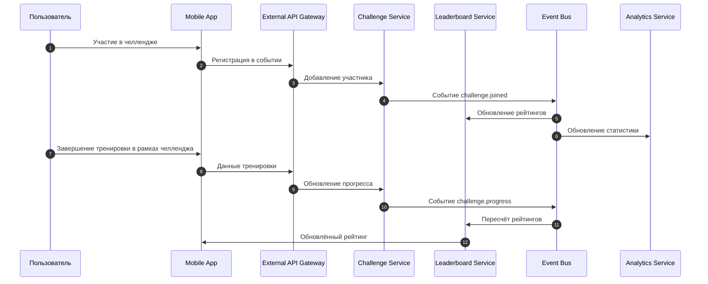

# Критические бизнес-сценарии

## 1. Сценарий: Запись и завершение тренировки

### Описание
Пользователь запускает тренировку, система получает телеметрию, фиксирует результаты и обновляет аналитику.

### Почему критично
- Основная ценность продукта.  
- Источник данных для рекомендаций, геймификации и социальной активности.  
- Высокая частота использования.

### Требования к архитектуре
- Низкая задержка при приёме данных.  
- Буферизация телеметрии.  
- Устойчивость к нестабильным каналам связи.  
- Масштабируемость при пиковых нагрузках.

## 2. Сценарий: Публикация результата тренировки в социальную ленту

### Описание
После завершения тренировки событие отображается в ленте активности друзей и групп.

### Почему критично
- Основной драйвер вовлечённости.  
- Формирует социальную ткань платформы.  
- Влияет на удержание и восприятие бренда.
- Является рекламой для других пользователей

### Требования к архитектуре
- Event-driven взаимодействие.  
- Быстрая генерация ленты (кэширование, денормализация).  
- Низкая задержка уведомлений.

## 3. Сценарий: Получение персональных рекомендаций и промо

### Описание
Пользователь получает рекомендации по тренировкам, восстановлению и инвентарю, включая персональные промо.

### Почему критично
- Прямое влияние на вовлечённость.  
- Прямое влияние на монетизацию.  
- Требует качественных данных и ML-моделей.

### Требования к архитектуре
- Доступ к агрегированным данным.  
- Быстрый отклик Recommendation Service.  
- Интеграция с e-commerce.  
- Региональные каталоги.

	
## 4. Сценарий: Массовые челленджи и соревнования

### Описание
Пользователь участвует в челленджах, результаты обновляются в реальном времени, система выдерживает пиковые нагрузки.

### Почему критично
- Сильный мотиватор для регулярных тренировок.  
- Высокие нагрузки (до 100k+ участников).  
- Важный элемент позиционирования бренда.

### Требования к архитектуре
- Горизонтальное масштабирование.  
- Асинхронная обработка событий.  
- Оптимизация рейтингов и агрегатов.  
- Защита от мошенничества.

---

Эти четыре сценария покрывают:
- ядро продукта (тренировки),  
- вовлечённость (социальная лента),  
- монетизацию (рекомендации и промо),  
- масштабируемость (массовые события).

Они являются основой для проектирования архитектуры и проверки её жизнеспособности.
