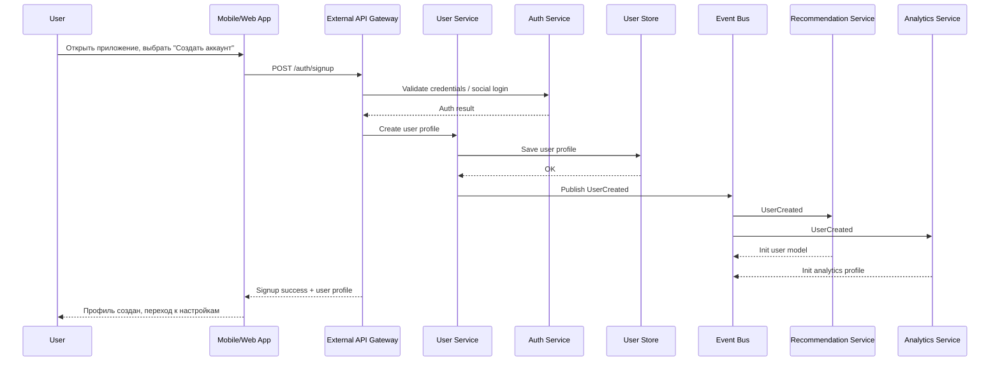
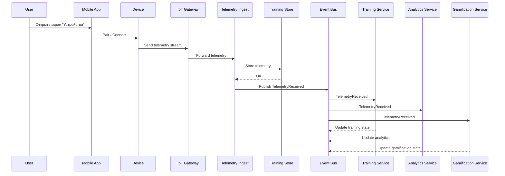
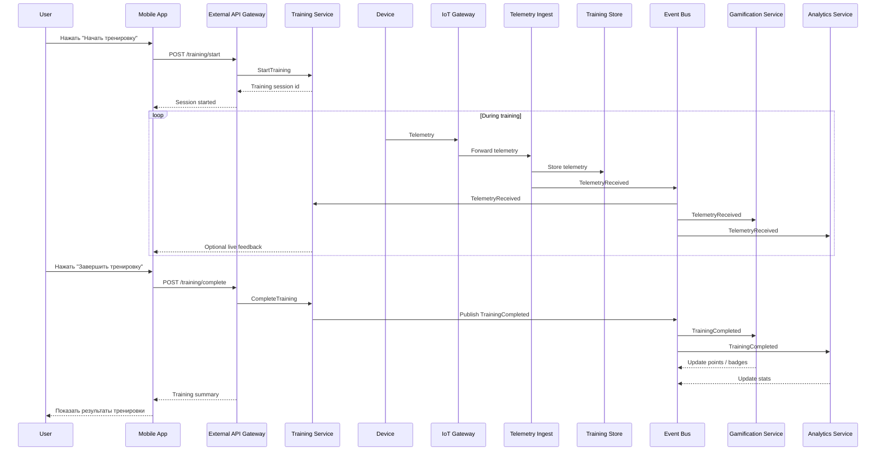
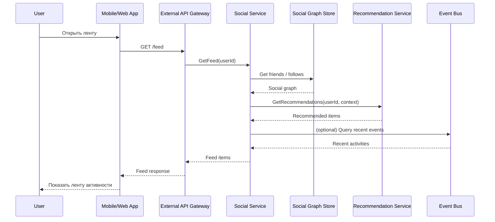
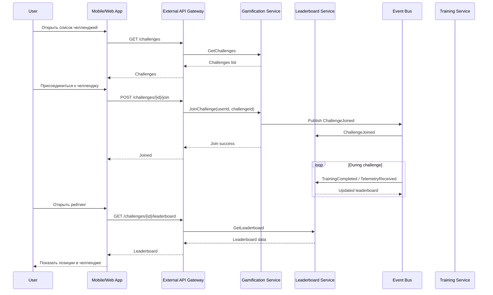
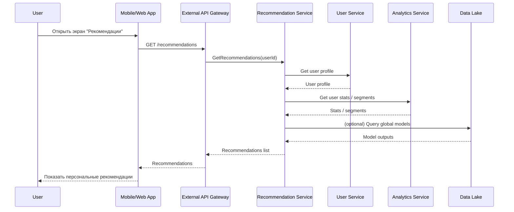
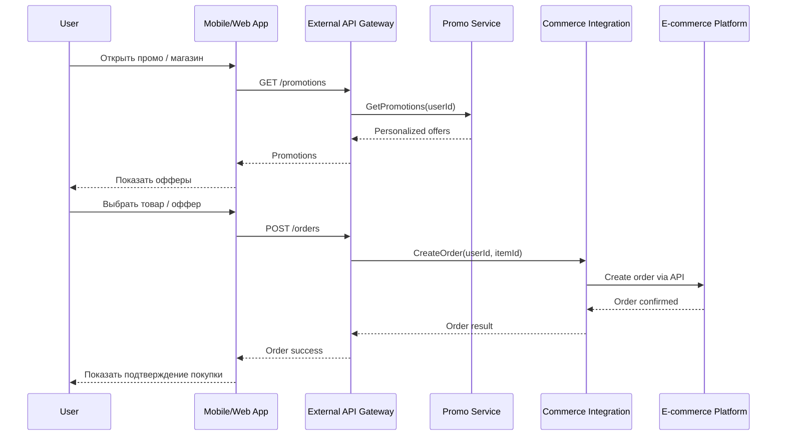
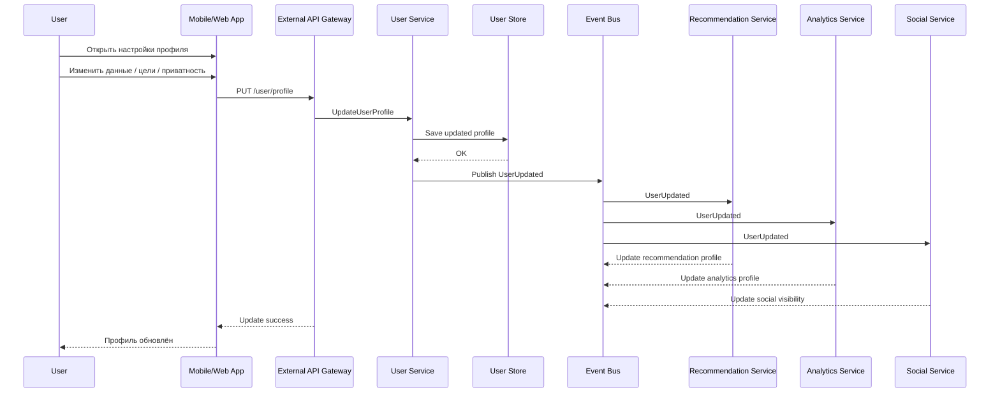

# 12. Сценарии использования приложения

Ниже приведены ключевые пользовательские сценарии, отражающие основные ценности платформы: тренировки, социальное взаимодействие, челленджи, геймификация и рекомендации.  
Каждый сценарий описывает последовательность действий пользователя и реакцию системы на уровне концептуальной архитектуры.

## 1. Регистрация и создание профиля

### Описание
Пользователь устанавливает приложение, создаёт аккаунт и настраивает профиль.

### Основной поток
1. Пользователь открывает приложение и выбирает «Создать аккаунт».
2. Вводит email/телефон или использует социальный логин.
3. Приложение отправляет запрос в **External API Gateway**.
4. **User Service** создаёт профиль и сохраняет данные в **User Store**.
5. Пользователь настраивает цели, параметры и предпочтения.
6. **User Service** публикует событие *UserCreated* в **Event Bus**.
7. **Recommendation Service** и **Analytics Service** инициализируют модели для нового пользователя.

### Ценность
Быстрый вход в платформу и персонализация с первого шага.

## 2. Подключение устройства и сбор телеметрии

### Описание
Пользователь подключает фитнес-браслет или другое устройство, которое отправляет данные о тренировке.

### Основной поток
1. Пользователь открывает экран «Устройства».
2. Приложение инициирует подключение через BLE/MQTT/HTTPS.
3. Устройство отправляет телеметрию в **IoT Gateway**.
4. **Telemetry Ingest** валидирует данные и сохраняет их в **Training Store**.
5. События *TelemetryReceived* публикуются в **Event Bus**.
6. **Training Service**, **Analytics Service** и **Gamification Service** реагируют на события.

### Ценность
Надёжный сбор данных в реальном времени, основа для всех тренировочных функций.

## 3. Проведение тренировки

### Описание
Пользователь начинает тренировку, получает обратную связь и завершает сессию.

### Основной поток
1. Пользователь нажимает «Начать тренировку».
2. Приложение отправляет команду в **Training Service** через **External API Gateway**.
3. Устройство передаёт телеметрию в реальном времени.
4. **Training Service** обновляет состояние тренировки.
5. **Gamification Service** начисляет очки и прогресс.
6. По завершении тренировки создаётся событие *TrainingCompleted*.
7. **Analytics Service** обновляет статистику и рекомендации.

### Ценность
Бесшовный тренировочный опыт с мгновенной обратной связью.

## 4. Просмотр ленты активности

### Описание
Пользователь открывает ленту, чтобы увидеть активности друзей, рекомендации и челленджи.

### Основной поток
1. Приложение запрашивает ленту через **External API Gateway**.
2. **Social Service** формирует ленту на основе:
   - событий из **Event Bus**,
   - данных из **Social Graph Store**,
   - рекомендаций от **Recommendation Service**.
3. Лента возвращается пользователю с минимальной задержкой.

### Ценность
Социальная вовлечённость и мотивация через активности друзей.

## 5. Участие в челленджах

### Описание
Пользователь присоединяется к челленджу и соревнуется с другими.

### Основной поток
1. Пользователь выбирает челлендж в приложении.
2. **Gamification Service** регистрирует участие.
3. Во время тренировок события *TelemetryReceived* и *TrainingCompleted* обновляют прогресс.
4. **Leaderboard Service** пересчитывает позиции участников.
5. Пользователь видит обновлённый рейтинг в реальном времени.

### Ценность
Геймификация и социальная мотивация.

## 6. Получение персональных рекомендаций

### Описание
Пользователь получает рекомендации по тренировкам, челленджам и активности.

### Основной поток
1. Приложение запрашивает рекомендации через **External API Gateway**.
2. **Recommendation Service** использует:
   - данные профиля,
   - историю тренировок,
   - социальный граф,
   - аналитику из **Data Lake**.
3. Сервис возвращает персонализированные предложения.

### Ценность
Улучшение результатов и удержание пользователя.

## 7. Покупка товаров и участие в промо

### Описание
Пользователь получает персональные предложения и совершает покупку.

### Основной поток
1. Приложение запрашивает промо-предложения.
2. **Promo Service** формирует персональные офферы.
3. Пользователь переходит к покупке.
4. **Commerce Integration Service** взаимодействует с e-commerce платформой.
5. Покупка отображается в профиле пользователя.

### Ценность
Монетизация и персонализированный маркетинг.

## 8. Управление профилем и настройками

### Описание
Пользователь обновляет личные данные, цели, приватность и уведомления.

### Основной поток
1. Приложение отправляет изменения в **User Service**.
2. Данные обновляются в **User Store**.
3. Событие *UserUpdated* публикуется в **Event Bus**.
4. **Analytics**, **Recommendations** и **Social** обновляют свои модели.

### Ценность
Контроль над данными и персонализация.

---

## Таблица соответствия сценариев, доменов и NFR

| № | Сценарий использования | Основные домены / сервисы | Ключевые NFR |
|---|------------------------|----------------------------|---------------|
| **1** | Регистрация и создание профиля | User Service, Auth Service, Recommendation Service, Analytics Service, Event Bus | Производительность (≤200 мс), Надёжность, Наблюдаемость, Безопасность |
| **2** | Подключение устройства и сбор телеметрии | IoT Gateway, Telemetry Ingest, Training Store, Training Service, Analytics, Gamification | Производительность (телеметрия ≤2 сек), Масштабируемость, Надёжность |
| **3** | Проведение тренировки | Training Service, IoT Gateway, Telemetry Ingest, Gamification, Analytics, Event Bus | Производительность, Надёжность (RPO ≤30 сек), Масштабируемость |
| **4** | Просмотр ленты активности | Social Service, Social Graph Store, Recommendation Service, Event Bus | Производительность (лента ≤150 мс), Масштабируемость, Наблюдаемость |
| **5** | Участие в челленджах | Gamification Service, Leaderboard Service, Training Service, Event Bus | Масштабируемость (100k участников), Производительность, Надёжность |
| **6** | Получение персональных рекомендаций | Recommendation Service, Analytics Service, User Service, Data Lake | Производительность, Масштабируемость, Интероперабельность |
| **7** | Покупка товаров и промо | Promo Service, Commerce Integration, External E‑commerce | Безопасность, Интероперабельность, Производительность |
| **8** | Управление профилем и настройками | User Service, Social Service, Analytics, Recommendation Service, Event Bus | Надёжность, Безопасность, Наблюдаемость |

---

Эти сценарии использования:

- отражают ключевые пользовательские ценности,  
- согласованы с концептуальной архитектурой,  
- задействуют все основные домены (Training, Social, Gamification, Analytics, IoT),  
- демонстрируют работу API Gateway, Event Bus, Data Lake и региональных хранилищ,  
- служат основой для проектирования пользовательских потоков, API и тестирования.

