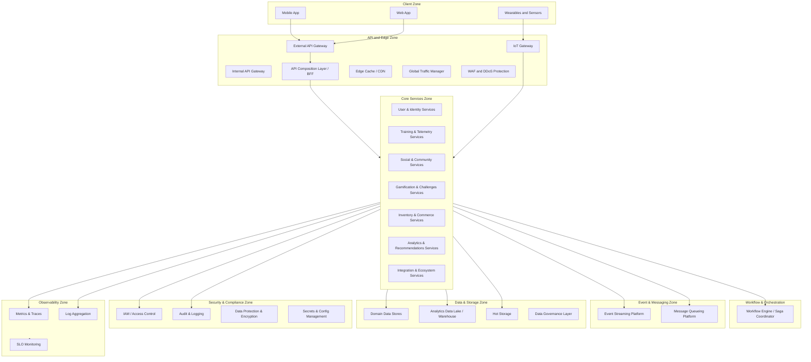

# 13. Базовая архитектура с учётом ограничений бизнес-требований, НФТ, выбранной архитектуры и адресации атрибутов качества

Базовая архитектура определяет организацию ключевых зон и сервисов платформы, обеспечивающих выполнение бизнес-требований, нефункциональных требований (NFR), архитектурных решений (ADR) и целевых SLO/SLA. Архитектура ориентирована на глобальную социальную фитнес-платформу с высокой нагрузкой, мультиоблачным размещением, региональным хранением данных и интеграцией с устройствами.

## 1. Client Zone

### **Mobile App**  
Основной пользовательский интерфейс платформы; отображает ленту, тренировки, челленджи и рекомендации.

### **Web App**  
Веб-клиент для доступа к функциональности платформы через браузер.

### **Wearables & Sensors**  
Устройства, передающие телеметрию активности и состояния пользователя.

## 2. API & Edge Zone

### **External API Gateway**  
Маршрутизация клиентских запросов, авторизация, rate limiting, защита периметра.

### **Internal API Gateway**  
Доступ внутренних сервисов и административных инструментов; изоляция внутренних контуров.

### **IoT Gateway**  
Приём телеметрии от устройств, поддержка протоколов MQTT/HTTPS, нормализация входящих данных.

### **API Composition Layer (BFF)**  
Агрегирует данные из нескольких сервисов в единый оптимизированный ответ для мобильного и веб-клиента.

### **Edge Cache / CDN**  
Кэширование статических и полу-динамических данных для снижения задержек.

### **Global Traffic Manager**  
Распределяет трафик между регионами и облаками, обеспечивает отказоустойчивость.

### **WAF / DDoS Protection**  
Защита API от атак, фильтрация вредоносного трафика.

## 3. Core Services Zone

Ниже перечислены конкретные сервисы, входящие в каждую доменную группу.

### **User & Identity**
- **User Service** — управление профилями пользователей.  
- **Auth Service** — аутентификация, токены.  
- **Consent Management** — управление пользовательскими согласиями.

### **Training & Telemetry**
- **Training Service** — управление тренировками.  
- **Telemetry Ingest Service** — приём и нормализация телеметрии.  
- **Real-time Training State Engine** — расчёт состояния тренировки в реальном времени.

### **Social & Community**
- **Social Service** — социальный граф.  
- **Group Service** — группы и клубы.  
- **Discovery Service** — поиск друзей и групп.  
- **Feed Engine** — формирование ленты активности.

### **Gamification & Engagement**
- **Gamification Service** — очки, бейджи, прогресс.  
- **Leaderboard Service** — рейтинги.  
- **Challenge Service** — челленджи.

### **Inventory & Commerce**
- **Inventory Service** — виртуальные товары.  
- **Promo Service** — промо-механики.  
- **Commerce Integration Service** — интеграции с e-commerce.

### **Analytics & Recommendations**
- **Analytics Service** — аналитические агрегаты.  
- **Recommendation Service** — персональные рекомендации.  
- **Scoring Service** — ML-скоринг.  
- **Feature Store** — признаки для ML.  
- **Model Serving Layer** — онлайн-инференс моделей.

### **Integration & Ecosystem**
- **Integration Hub** — унифицированный слой интеграций.  
- **3rd-Party Integration Service** — партнёрские API.  
- **API Schema Registry** — контракты REST API.  
- **Event Schema Registry** — контракты событий.

## 4. Workflow & Orchestration Zone

### **Workflow Engine**  
Оркестрация многошаговых процессов (тренировки, челленджи, покупки).

### **Saga Coordinator**  
Согласованность распределённых операций и компенсации при сбоях.

## 5. Event & Messaging Zone

### **Event Streaming Platform**  
Платформа для публикации и потребления событий. Обеспечивает event log, partitioning, retention, replay.

### **Message Queueing Platform**  
Платформа для асинхронной обработки задач. Обеспечивает очереди, гарантированную доставку, retry-политики и DLQ.

## 6. Data & Storage Zone

### **Domain Data Stores**  
Хранилища данных по доменам (профили, тренировки, граф, инвентарь, геймификация).

### **Analytics Data Lake / Warehouse**  
Централизованное хранилище для аналитики, отчётности и ML-моделей.

### **Hot Storage**  
Высокопроизводительное хранилище для быстрых операций (лента, рейтинги, рекомендации).

### **Data Governance Layer**  
Политики хранения, маскирования, качества и жизненного цикла данных.

## 7. Security & Compliance Zone

### **IAM / Access Control**  
Управление доступом, токенами, ролями и политиками безопасности.

### **Audit & Logging**  
Фиксация действий пользователей и сервисов для контроля и расследований.

### **Data Protection & Encryption**  
Шифрование данных в движении и покое, защита PII.

### **Secrets & Config Management**  
Безопасное хранение секретов и конфигураций.

## 8. Observability Zone

### **Metrics & Traces**  
Сбор метрик и трассировок для анализа производительности.

### **Log Aggregation**  
Централизованный сбор логов.

### **SLO Monitoring**  
Контроль выполнения целевых показателей качества.

---

## SLI / SLO / SLA для критических сценариев

| Сценарий | SLI | SLO | SLA |
|---------|-----|------|------|
| Лента | Latency p95 | ≤150 ms | 99.5% |
| Телеметрия | Ingest delay p99 | ≤2 s | 99.9% |
| Старт тренировки | API latency p95 | ≤200 ms | 99.5% |
| Завершение тренировки | End-to-end processing | ≤5 s | 99.5% |
| Рейтинги | Leaderboard update | ≤3 s | 99% |
| Рекомендации | Recommendation latency | ≤250 ms | 99% |
| Авторизация | Auth latency p95 | ≤120 ms | 99.9% |
| Покупки | Commerce success rate | ≥99% | 99% |
| Профиль | Write latency | ≤150 ms | 99.5% |

---

## Адресация атрибутов качества

| Атрибут качества | Архитектурные элементы | Механизмы |
|------------------|------------------------|-----------|
| Производительность | API & Edge, Core, Hot Storage | BFF, кэширование, оптимизация хранилищ |
| Масштабируемость | Core, Events, Data | микросервисы, event-driven, autoscaling |
| Надёжность | Workflow, Messaging, Security | ретраи, DLQ, оркестрация |
| Безопасность | API, Security Zone | IAM, шифрование, zero-trust |
| Соответствие требованиям | Data, Security | data locality, governance |
| Наблюдаемость | Observability Zone | метрики, логи, трассировка |
| Поддерживаемость | Core, Integration | DDD, schema registry |
| Интероперабельность | IoT, Commerce, Integration | стандартизированные API |
| Адаптивность | Client, Recommendations | feature flags, ML-модели |

---

## Логическая схема

