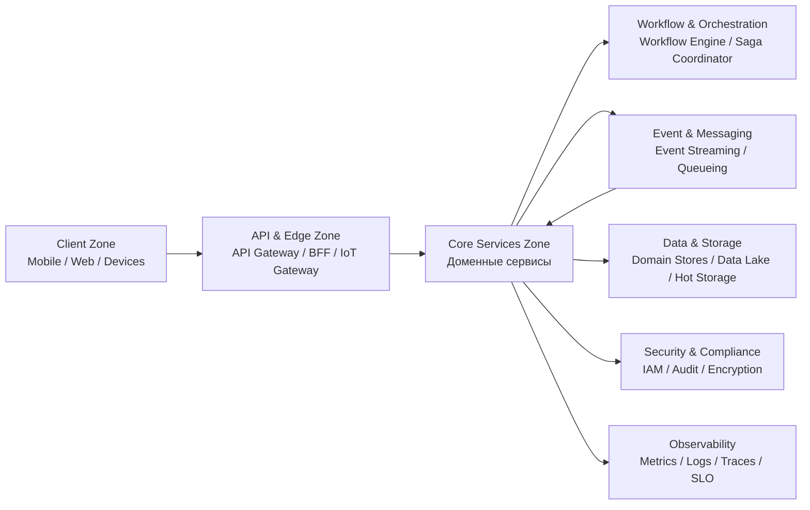
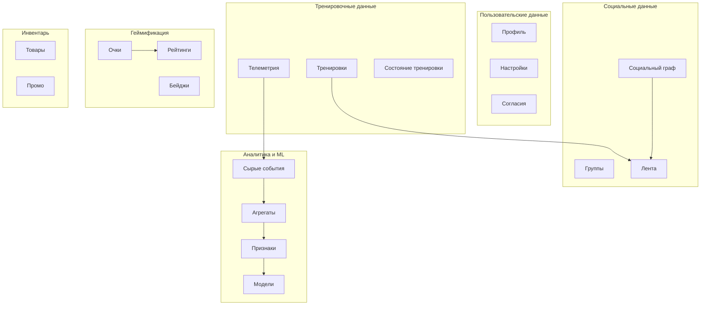
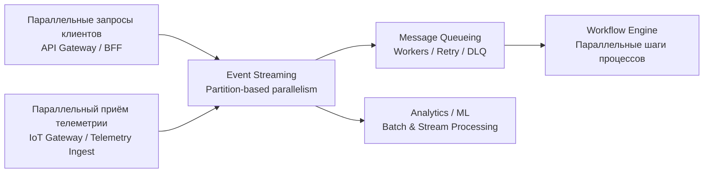
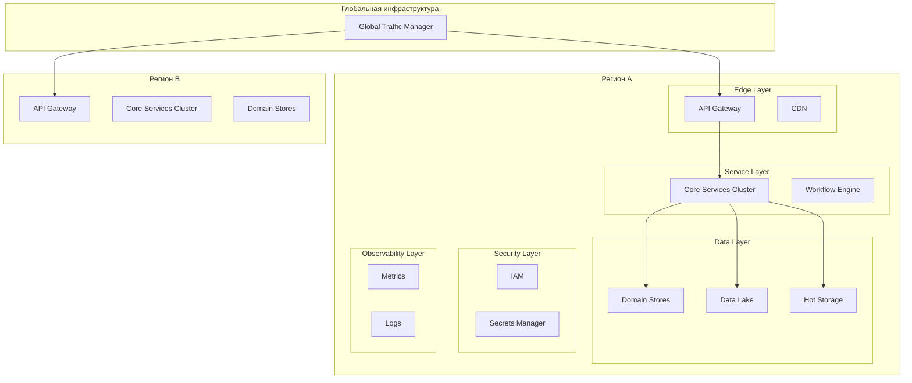
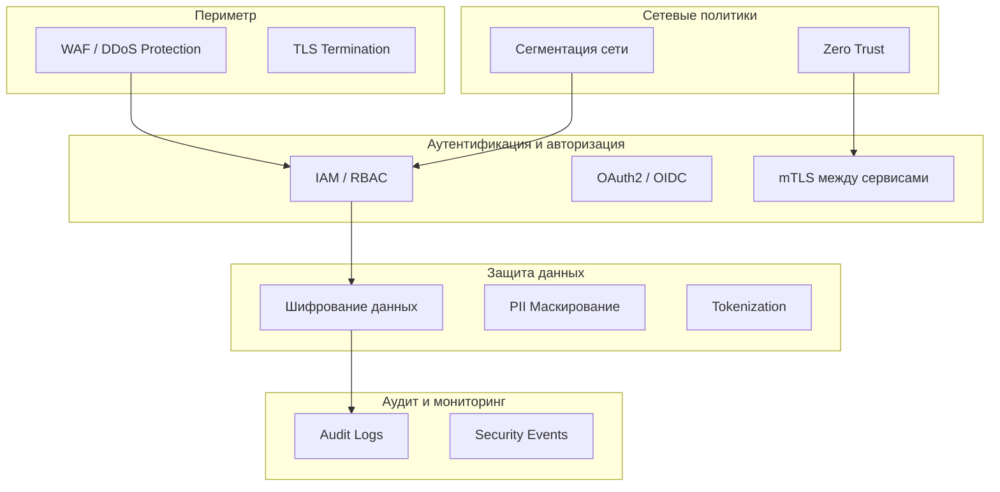

# 14. Основные архитектурные представления

Данный раздел описывает ключевые архитектурные представления системы: функциональное, информационное, многозадачность (concurrency), инфраструктурное и безопасность.  

## a. Функциональное представление

Функциональное представление описывает основные подсистемы, их ответственность и взаимодействие при реализации ключевых пользовательских сценариев.

### **Client Zone**
- Взаимодействие пользователя с системой.  
- Отображение ленты, тренировок, челленджей, рекомендаций.  
- Передача телеметрии с устройств.

### **API & Edge Zone**
- Приём запросов от клиентов и устройств.  
- Агрегация данных (BFF).  
- Оптимизация трафика (CDN, кэш).  
- Защита периметра.

### **Core Services Zone**
- Реализация бизнес-логики по доменам:  
  - User & Identity  
  - Training & Telemetry  
  - Social & Community  
  - Gamification & Challenges  
  - Inventory & Commerce  
  - Analytics & Recommendations  
  - Integration & Ecosystem  

### **Workflow & Orchestration**
- Оркестрация многошаговых процессов.  
- Управление сагами и компенсациями.

### **Event & Messaging**
- Асинхронная коммуникация между сервисами.  
- Обработка событий и фоновых задач.

### **Data & Storage**
- Хранение доменных данных.  
- Аналитика и ML.  
- Горячие данные для быстрого доступа.

### **Security & Observability**
- Контроль доступа, аудит, шифрование.  
- Метрики, логи, трассировка, мониторинг SLO.

## b. Информационное представление

Информационное представление описывает основные типы данных, их потоки, хранилища и границы владения.

### **Основные доменные данные**

#### Пользовательские данные
- Профиль, настройки, разрешения.  
- Хранятся в User Store.  
- Владельцы: User & Identity Services.

#### Тренировочные данные
- Сырые данные телеметрии.  
- Агрегированные данные тренировок.  
- Хранятся в Training & Telemetry Store.  
- Владельцы: Training & Telemetry Services.

#### Социальные данные
- Социальный граф, связи, группы.  
- Лента активности.  
- Хранятся в Social Graph Store.  
- Владельцы: Social & Community Services.

#### Геймификация
- Очки, бейджи, прогресс, рейтинги.  
- Хранятся в Gamification Store.  
- Владельцы: Gamification Services.

#### Инвентарь и промо
- Виртуальные товары, бонусы, скидки.  
- Хранятся в Inventory Store.  
- Владельцы: Inventory & Commerce Services.

#### Аналитика и ML
- Сырые события → Data Lake.  
- Агрегаты → Warehouse.  
- Признаки → Feature Store.  
- Модели → Model Serving.

### **Таблица типов данных и рекомендуемых типов СУБД**

| Домен | Тип данных | Хранилище | Тип СУБД / Хранилища | Причина выбора |
|-------|------------|-----------|-----------------------|----------------|
| **User & Identity** | Профиль, настройки, согласия | User Store | **Реляционная СУБД (OLTP)** | Строгая структура, транзакционность, консистентность |
| **Training & Telemetry** | Телеметрия, временные ряды, агрегаты | Training & Telemetry Store | **Time-Series DB** | Высокая скорость записи, оптимизация под временные ряды |
| **Training (Real-time)** | Состояние тренировки в реальном времени | Training State Engine Store | **In-memory key-value** | Минимальная задержка, быстрые обновления |
| **Social Graph** | Социальные связи, граф друзей | Social Graph Store | **Графовая СУБД** | Быстрые операции по графу, traversal-запросы |
| **Feed / Activity** | Лента активности, события | Hot Storage | **In-memory key-value store** | Низкая задержка, быстрые выборки |
| **Groups & Community** | Группы, клубы, участники | Community Store | **Документная СУБД** | Гибкая структура, быстрые выборки |
| **Gamification** | Очки, бейджи, прогресс | Gamification Store | **Key-value / Document store** | Простая структура, быстрые обновления |
| **Leaderboards** | Рейтинги, позиции | Leaderboard Store | **In-memory sorted sets** | Быстрые операции ранжирования |
| **Inventory & Promo** | Товары, бонусы, скидки | Inventory Store | **Реляционная СУБД** | Транзакционность, связи, целостность |
| **Commerce Integration** | Транзакции, статусы | Commerce Store | **Реляционная СУБД** | ACID-гарантии |
| **Raw Events** | Сырые события, телеметрия | Data Lake | **Object Storage** | Дешёвое хранение больших объёмов |
| **Analytics** | Агрегаты, отчёты | Data Warehouse | **Columnar Analytical DB (OLAP)** | Быстрые аналитические запросы |
| **ML Features** | Признаки для моделей | Feature Store | **Key-value + Columnar** | Быстрый онлайн-доступ + оффлайн-хранение |
| **ML Models** | Модели, артефакты | Model Repository | **Blob Storage** | Хранение бинарных моделей |
| **Recommendations** | Результаты инференса | Recommendation Cache | **In-memory key-value** | Быстрый доступ для клиента |

---

### **Основные потоки данных**

- **Телеметрия → IoT Gateway → Telemetry Ingest → Event Streaming → Training Store**  
- **События активности → Event Streaming → Feed Engine → Hot Storage → BFF → Клиент**  
- **События челленджей → Event Streaming → Gamification → Leaderboard → Hot Storage**  
- **Сырые события → Data Lake → Analytics → Recommendations → BFF → Клиент**

---

## c. Представление многозадачности (Concurrency)

Определяет, как система обрабатывает параллельные запросы, события и фоновые задачи.

### **Основные механизмы параллелизма**

#### 1. Горизонтальное масштабирование сервисов
- Каждый сервис Core масштабируется независимо.  
- Stateless-сервисы масштабируются автоматически.  
- Stateful-сервисы используют шардирование и partitioning.

#### 2. Event Streaming Platform
- Partition-based параллелизм.  
- Высокая пропускная способность для телеметрии и событий.  
- Независимые потребители для каждого домена.

#### 3. Message Queueing Platform
- Worker-based параллелизм.  
- Параллельная обработка фоновых задач.  
- Retry-политики и DLQ.

#### 4. Workflow Engine
- Параллельное выполнение шагов процессов.  
- Управление долгоживущими транзакциями.

#### 5. API Composition Layer
- Параллельные запросы к backend-сервисам.  
- Агрегация результатов.

#### 6. Data Lake / Analytics
- Параллельная обработка данных (Spark, Flink, BigQuery и т.п.).

### **Concurrency hotspots**
- Приём телеметрии (высокий throughput).  
- Формирование ленты (много подписчиков).  
- Пересчёт рейтингов (параллельные batch-процессы).  
- Рекомендации (параллельные запросы к ML-моделям).

## d. Инфраструктурное представление

Определяет размещение компонентов, сетевые границы, зоны доступности и взаимодействие между облаками.

### **Основные элементы инфраструктуры**

#### 1. Мультиоблачная архитектура
- Развёртывание в нескольких облаках (multi-cloud).  
- Независимые региональные кластеры.  
- Глобальный балансировщик трафика.

#### 2. Зоны доступности
- Каждый регион развёрнут в нескольких AZ.  
- Event Streaming и Data Stores используют репликацию.

#### 3. Сетевые сегменты
- Public Edge (API Gateway, CDN).  
- Private Services (Core Services).  
- Data Zone (хранилища).  
- Secure Zone (IAM, Secrets).  
- Observability Zone.

#### 4. CI/CD Pipeline
- Автоматизированные деплои.  
- Canary / Blue-Green стратегии.  
- Контроль версий контрактов (API + Event Schema Registry).

#### 5. Мониторинг и логирование
- Централизованные метрики, логи, трассировки.  
- SLO-ориентированный мониторинг.

## e. Представление безопасности

Определяет механизмы защиты данных, сервисов, пользователей и инфраструктуры.

### **Основные уровни безопасности**

#### 1. Периметр
- WAF  
- DDoS-защита  
- Rate limiting  
- TLS termination

#### 2. Аутентификация и авторизация
- IAM / RBAC  
- OAuth2 / OIDC  
- Service-to-service mTLS  
- Token-based access

#### 3. Защита данных
- Шифрование в движении (TLS 1.2+)  
- Шифрование в покое (KMS)  
- PII-маскирование  
- Tokenization

#### 4. Сетевые политики
- Zero-Trust  
- Segmentation (Public / Private / Data / Secure)  
- Firewall rules  
- Private endpoints

#### 5. Аудит и мониторинг
- Audit logs  
- Security events  
- Alerting  
- Compliance-контроль (GDPR, локальные требования)

#### 6. Управление секретами
- Secrets Manager  
- Rotation policies  
- Least privilege access

